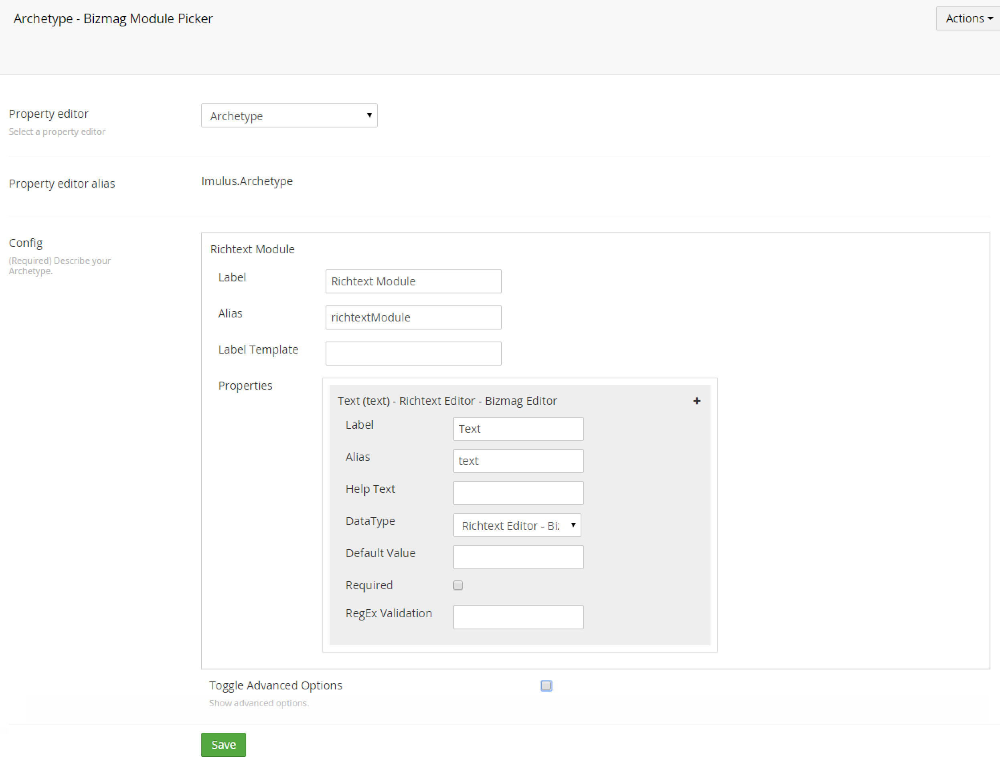
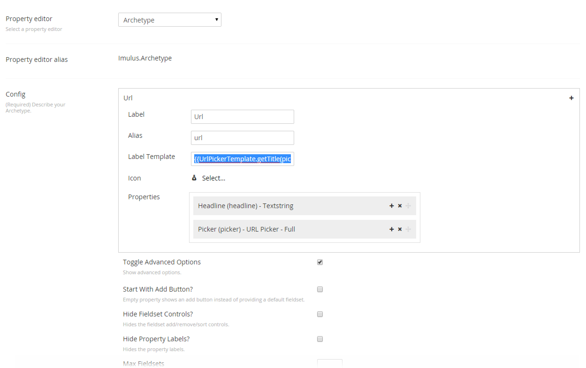

#Configuration#

Configuration can seem daunting, but to create your first Archetype, do the the following:

* Navigate to `Developer->Data Type`
* Right click and create a new data type.
* Select `Archetype` from the dropdown.
* Name your fieldset
* Give your fieldset an alias (or accept the default)
* Add one or more properties
* Each property needs a name, an alias and a data type

That is all that is required.



Tick the `Toggle Advanced Options` box to expose advanced options.

##Add to a Document Type##
Once configured, navigate to `Settings->Document Types` and add the new data type to a document type.

##Multiple Fieldsets##

You can enable multiple fieldsets in a single Archetype by going into the advanced options and ticking `Enable Multiple Fieldsets?`.

This will expose a hidden plus sign that allows that you'll need to click to add another fieldset type.  It also allows you to choose an installed icon to separate the two types visually once added to a document type.

##Nested Archetypes##

You can even nest Archetypes within Archetypes provided they are not referencing themselves.

##Label Template##

You can configure Archetype to show a value from inside your Archetype to be shown on the collapsed fieldset title.

Typically you would use this syntax in the `Label Template` box: `{{propertyName}}`.

Using the above syntax will get the value of the property and use it as the label.  However some data types have a complex model value and therefore it doesn't make sense to do so.  The following example shows how to grab the title field from the [UrlPicker](https://www.nuget.org/packages/UrlPicker/) data type and use it as the label:

First we will need to add some code to our project by registering it with a `package.manifest` file at `~/App_Plugins/ArchetypeLabelTemplates/package.manifest`:

```
{
  "javascript": [
    "~/App_Plugins/ArchetypeLabelTemplates/urlpicker.js"
  ]
}
```

Then create your `urlpicker.js` file at the above location and define a function:

```
var UrlPickerTemplate = {};
 
UrlPickerTemplate.getTitle = function (value, scope) { 
    //this is the property model
    if (value) {
        return value.meta.title;
    }
    
    //if you wanted to get the name of the content instead, you'd have to get it from the server here since it's not in the model
 
    return "";
};
```

Finally, call your new function from inside the Archetype config (`{{UrlPickerTemplate.getTitle(picker)}}`).  Please note you pass the property alias to your function.  Your function then takes two arguments (value and scope).



As of v1.8, you can now pass arguments and take advantage of Archetype AngularJs services, for example you can now do this:

```js
var ArchetypeSampleLabelTemplates = (function() {

    //public functions
    return {
        Entity: function (value, scope, args) {

           if(!args.entityType) {
                args = {entityType: "Document", propertyName: "name"}
            }

            if (value) {
                //if handed a csv list, take the first only
                var id = value.split(",")[0];

                if (id) {
                    var entity = scope.services.archetypeLabelService.getEntityById(scope, id, args.entityType);

                    if(entity) {
                        return entity[args.propertyName];
                    }
                }
            }

            return "";
        },
        UrlPicker: function(value, scope, args) {

            if(!args.propertyName) {
                args = {propertyName: "name"}
            }

            var entity;

            switch (value.type) {
                case "content":
                    if(value.typeData.contentId) {
                        entity = scope.services.archetypeLabelService.getEntityById(scope, value.typeData.contentId, "Document");
                    }
                    break;

                case "media":
                    if(value.typeData.mediaId) {
                        entity = scope.services.archetypeLabelService.getEntityById(scope, value.typeData.mediaId, "Media");
                    }
                    break;

                case "url":
                    return value.typeData.url;
                    
                default:
                    break;

            }

            if(entity) {
                return entity[args.propertyName];
            }

            return "";
        },
        Rte: function (value, scope, args) {

            if(!args.contentLength) {
                args = {contentLength: 50}
            }

            return $(value).text().substring(0, args.contentLength);
        }
    }
})();
```
>Please note that the above is just a sample of what you can do, it covers several label template functions.

Note that you can take advantage of the built-in label service that handles some local caching for performance.  You pass arguments to you function by configuring your label template like so:

```
{{ArchetypeSampleLabelTemplates.UrlPicker(myproperty, {myarg: 1, myotherarg: 2})}}
```

There is also automatic detection built in for RTE, UrlPicker and MNTP so you don't even have to write a function any longer for those.

##Change the Style of Archetype in the Backoffice##
Archetype allows you to do the following to customize the backoffice experience for your editors:

* Modify the view globally
* Modify the view per Archetype data type instance
* Modify the CSS globally
* Modify the CSS per Archetype data type instance
* Add a JS script globally

###Global Changes###
To make global changes, simply edit any of these files:

* Any file located in: `~/App_Plugins/Archetype/views/`
* `~/App_Plugins/Archetype/css/archetype.css`

>Modifying these files will alter the look and feel of Archetype globally, however this is the same as modifying the core of Archetype and you'll have to make these changes after each upgrade to the next version of Archetype.

###Per Data Type Instance##
Archetype will allow you to also change the look and feel on a per data type basis as defined below:

* You can completely swap out the default view with another one. Navigate to `Developer>Data Types` and select your Archetype. Update the configuration property `View File` with a path to your new view file. v7.3+ users will find this under the `Custom Style/Script Options`. It's easiest to start with a copy of the `~/App_Plugins/Archetype/Views/archetype.default.html` file, make your changes and save it as a new view. Just remember to point your Archetype to the new view.
* Next you can add CSS and JS conditionally to a page. Since Umbraco is a pretty much a single page app, you can inject a CSS and/or a JS file by simply specifying a path to a CSS or JS file in the Archetype configuration. Again v7.3+ users will find this under the `Custom Style/Script Options`.
* Lastly, you can also quickly add a class to an Archetype for styling or JS purposes by specifying the `Custom Wrapper Class` field in the configuration.
>Note that these changes are resistant to upgrades of Archetype and will be kept without any worries unlike the global changes in the previous section.
